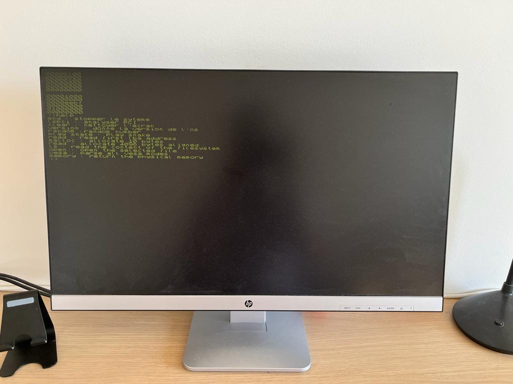

# Operating_System

## My Operating system written from scratch

This is my first operating system written from scratch. It is certainly not very powerful and it probably has several bugs but it allowed me to learn the basics of an operating system and drivers. I wrote it during my bachelor degree. This system is not intended to be functional or perfect. 

Right now I am working on it. It is absolutely normal, if some code is strange right now. This code will become better soon :)

### Memory map in the RAM

| **Address** | **Memory map**                  |
|-------------|---------------------------------|
| 0x1000      | VESA information                |
| 0x2000      | Block for VESA mode             |
| 0x3000      | Available physical memory       |
| 0x8000      | Kernel Loader                   |
| 0x100000    | Kernel                          |
| 0x10000000  | Kernel stack pointer            |
| 0x10000000  | Malloc function of the kernel   |

### Current features of the operating system 

* Protected mode
* Screen driver 
* Keyboard driver
* Pci driver
* Shell
* Timer & sleep_function
* Basic math library
* Basic graphics library
* Beep driver
* Snake ( When I am tired studying !! )
* Identity paging
* Basic ata driver
* Basic malloc function
* Basic virtual file system
* Global descriptor table 
* Retrieve VESA Information
* Retrieve the physical memory map
* Setting 1280 * 1024 resolution mode
* Retrieve physical memory map

### How to build it

You should have qemu, nasm, gcc & g++ installed on your computer. I tried my OS only on ubuntu. If you are on ubuntu and all dependencies are installed then write ./compile.sh on the terminal and it will run.

### Some ressouces that helped me 

**Description**  | **Link**
------------- | -------------
The first tutorial to read | https://www.cs.bham.ac.uk/~exr/lectures/opsys/10_11/lectures/os-dev.pdf
A webpage with a lot of diverse tutorials  | https://wiki.osdev.org/Expanded_Main_Page
Another webpage with a lot of ressources | http://www.brokenthorn.com/Resources/OSDevVid2.html
A tutorial with more advanced stuff | https://archive.is/dWJGu
